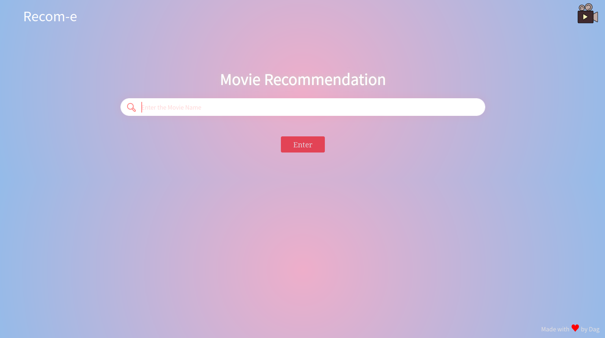
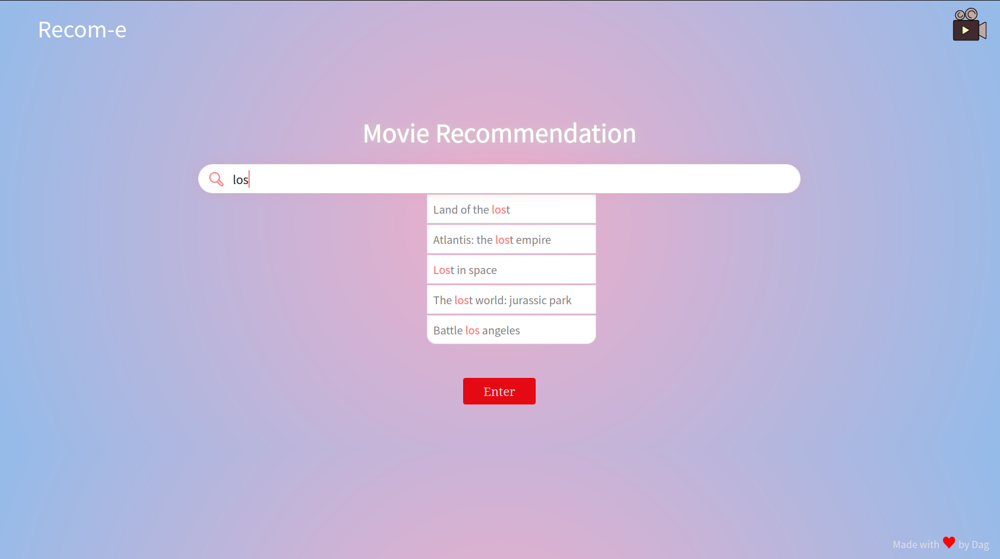

<h1 align="center">Recom-e - Movie Recommendation System</h1>

<!-- TABLE OF CONTENTS -->

  
Table of Contents

  <ol>
    <li>
      <a href="#about-the-project">About The Project</a>
      <ul>
        <li><a href="#salient-features">Salient Features</a></li>
        <li><a href="#built-with">Built With</a></li>
      </ul>
    </li>
    <li>
      <a href="#getting-started">Getting Started</a>
      <ul>
        <li><a href="#how-to-get-the-API-key?">How to get the API key</a></li>
        <li><a href="#how-to-run-the-project?">How to run the project</a></li>
      </ul>
   </li>
   <li><a href="#architecture">Architecture</a></li>
   <li><a href="#methods used">Methods used</a></li>
   <ul>
     <li><a href="#content-based-filtering">Content based Filtering</li>
     <li><a href="#similarity-score">Similarity Score</li>
     <li><a href="#how-cosine=similarity-works">How Cosine Similarity works?</li> 
   </ul>
      <li><a href="#navigating-through-the-app">Navigating through the App</a></li>
    <ul>
      <li><a href="#home-page">Home page</a></li>
      <li><a href="#searching-for-a-movie">Searching for a movie</a></li>
    </ul>
    <li><a href="#sources-of-the-datasets">Sources of the datasets</a></li>
    <li><a href="#resources-used">Resources Used</a></li>
  </ol>

## About the project
* Movie Recommendation System
* It is a recommendation system made using Content based Filtering approach

### Salient Features
* Recommends movies based on the likes of the user
* Gives the details of the movie and its cast searched by the user using API
* Analyses the sentiments of the reviews given by user

### Built With
* 
* 
* 
* 

## Getting Started

### How to get the API key?

Create an account in https://www.themoviedb.org/, click on the `API` link from the left hand sidebar in your account settings and fill all the details to apply for API key. If you are asked for the website URL, just give "NA" if you don't have one. You will see the API key in your `API` sidebar once your request is approved.

### How to run the project?

1. Clone or download this repository to your local machine.
2. Install all the libraries mentioned in the [requirements.txt](https://github.com/daneg69/Recom-e/blob/master/requirements.txt) file with the command `pip install -r requirements.txt`
3. Get your API key from https://www.themoviedb.org/. (Refer the above section on how to get the API key)
3. Replace YOUR_API_KEY in **both** the places (line no. 15 and 29) of `static/recommend.js` file and hit save.
4. Open your terminal/command prompt from your project directory and run the file `main.py` by executing the command `python main.py`.
5. Go to your browser and type `http://127.0.0.1:5000/` in the address bar.

## Architecture

## Methods Used

### Content based Filtering
Content-based recommendation systems uses their knowledge about each product to recommend new ones. Recommendations are based on attributes of the item. Content-based recommender systems work well when descriptive data on the content is provided beforehand. “Similarity” is measured against product attributes.

Suppose I watch a movie in a particular genre, then I will be recommended movies within that specific genre. The movie's attributes, like title, year of release, director and cast, are also helpful in identifying similar movie content

### Similarity Score : 

   How does it decide which item is most similar to the item user likes? Here come the similarity scores.
   
   It is a numerical value ranges between zero to one which helps to determine how much two items are similar to each other on a scale of zero to one. This similarity score is obtained measuring the similarity between the text details of both of the items. So, similarity score is the measure of similarity between given text details of two items. This can be done by cosine-similarity.
   
### How Cosine Similarity works?
  Cosine similarity is a metric used to measure how similar the documents are irrespective of their size. Mathematically, it measures the cosine of the angle between two vectors projected in a multi-dimensional space. The cosine similarity is advantageous because even if the two similar documents are far apart by the Euclidean distance (due to the size of the document), chances are they may still be oriented closer together. The smaller the angle, higher the cosine similarity.
  
  

  
More about Cosine Similarity : [Understanding the Math behind Cosine Similarity](https://www.machinelearningplus.com/nlp/cosine-similarity/)

<!-- APP TUTORIAL-->
## Navigating Through The App

### Home page

### Searching for a movie
* The search bar has autocomplete feature.

<!-- ACKNOWLEGEMENTS -->
### Sources of the datasets 

1. [IMDB 5000 Movie Dataset](https://www.kaggle.com/carolzhangdc/imdb-5000-movie-dataset)
2. [The Movies Dataset](https://www.kaggle.com/rounakbanik/the-movies-dataset)
3. [List of movies in 2018](https://en.wikipedia.org/wiki/List_of_American_films_of_2018)
4. [List of movies in 2019](https://en.wikipedia.org/wiki/List_of_American_films_of_2019)
5. [List of movies in 2020](https://en.wikipedia.org/wiki/List_of_American_films_of_2020)

## Resources used
* [How to build a recommendation engine](https://www.youtube.com/watch?v=D4nXZMnKW4U)
* [Implementation of movie recommendation](https://www.youtube.com/watch?v=A_78fGgQMjM)
* [Recommender Systems](https://builtin.com/data-science/recommender-systems)
* [Top recommendation engine algorithms](https://itnext.io/what-are-the-top-recommendation-engine-algorithms-used-nowadays-646f588ce639)
